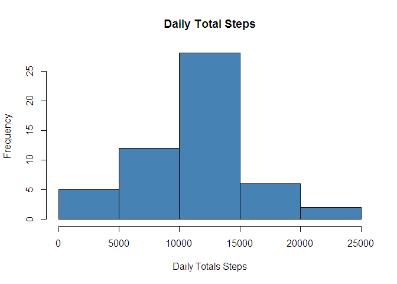
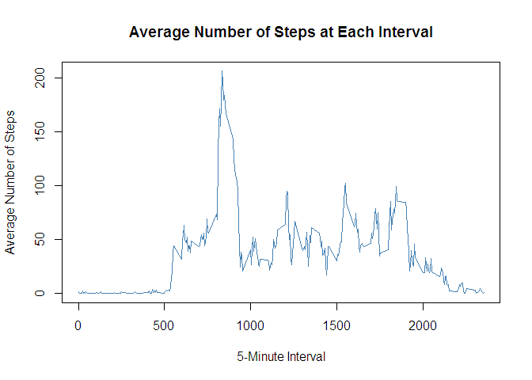
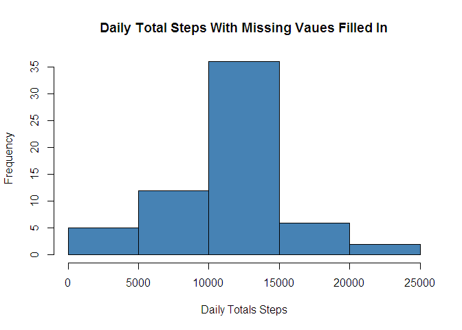
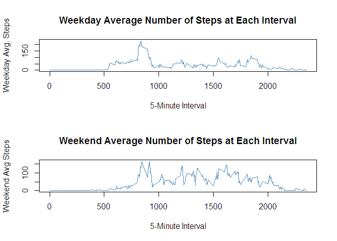

# Reproducible Research: Peer Assessment 1


## Loading and preprocessing the data


```r
data <- read.csv("activity.csv")
data$date<-as.Date(data$date,"%Y-%m-%d")
dataNoNA <- na.omit(data)
```

## What is mean total number of steps taken per day?


```r
totals <- tapply(dataNoNA$steps,dataNoNA$date,sum)
hist(totals, xlab = "Daily Totals Steps", col ="steelblue",main = "Daily Total Steps")
```

<!-- -->

The mean total number of steps taken daily:

```r
mean(totals)
```

```
## [1] 10766.19
```

The median total number of steps taken daily:

```r
median(totals)
```

```
## [1] 10765
```


## What is the average daily activity pattern?
 

```r
averages <- aggregate(dataNoNA$steps ~ dataNoNA$interval, FUN = mean)
plot(averages[, 1], averages[ ,2], type = "l", xlab = "5-Minute Interval", ylab = "Average Number of Steps", col = "steelblue", main = "Average Number of Steps at Each Interval")
```

<!-- -->

The 5-minute interval with the maximum average number of steps:

```r
averages[which.max(averages[ ,2]) ,1]
```

```
## [1] 835
```
The average number of steps at this interval:

```r
averages[which.max(averages[ ,2]) ,2]
```

```
## [1] 206.1698
```

## Imputing missing values

The total number of missing values in the dataset:

```r
sum(is.na(data$steps))
```

```
## [1] 2304
```

Create a new dataset 'dataFIMV' with missing values filled in using the daily average for that 5-minute interval:


```r
dataFIMV <- data
for(i in 1:length(dataFIMV$steps)){
  if(is.na(dataFIMV$steps[i])){
    dataFIMV$steps[i] <- averages[match(dataFIMV$interval[i], averages[,1]),2] 
  }
}
```


```r
totalsFIMV <- tapply(dataFIMV$steps,dataFIMV$date,sum)
hist(totalsFIMV, xlab = "Daily Totals Steps", col ="steelblue", main = "Daily Total Steps With Missing Vaues Filled In")
```

<!-- -->

The mean total number of steps taken daily with missing values filled in:

```r
mean(totalsFIMV)
```

```
## [1] 10766.19
```

The median total number of steps taken daily with missing values filled in:

```r
median(totalsFIMV)
```

```
## [1] 10766.19
```

Conclusion: The mean total steps was unchanged fro the estimates in the first part of the assignment, and the median changed only slightly. The impact of imputing missing data on the estimates was miniscule.  

## Are there differences in activity patterns between weekdays and weekends?
Create a new factor variable in the dataset with two levels - "weekday" and "weekend"


```r
weekdaysVar <- c('Monday', 'Tuesday', 'Wednesday', 'Thursday', 'Friday')

dataFIMV$wDay <- factor((weekdays(dataFIMV$date) %in% weekdaysVar), 
         levels=c(FALSE, TRUE), labels=c('weekend', 'weekday'))
```


```r
dataWeekdaySubset <- subset(dataFIMV, wDay == "weekday")
dataWeekendSubset <- subset(dataFIMV, wDay == "weekend")

weekdayAverages <- aggregate(dataWeekdaySubset$steps ~ dataWeekdaySubset$interval, FUN = mean)
weekendAverages <- aggregate(dataWeekendSubset$steps ~ dataWeekendSubset$interval, FUN = mean)

par(mfrow=c(2,1))
plot(weekdayAverages[, 1], weekdayAverages[ ,2], type = "l", xlab = "5-Minute Interval", ylab = "Weekday Avg. Steps", col = "steelblue", main = "Weekday Average Number of Steps at Each Interval")
plot(weekendAverages[, 1], weekendAverages[ ,2], type = "l", xlab = "5-Minute Interval", ylab = "Weekend Avg Steps", col = "steelblue", main = "Weekend Average Number of Steps at Each Interval")
```

<!-- -->

There appears to be a difference in the activity patterns between weekdays and weekends. On Average the steps seem to be more evenly distributed throughout the weekend days.
